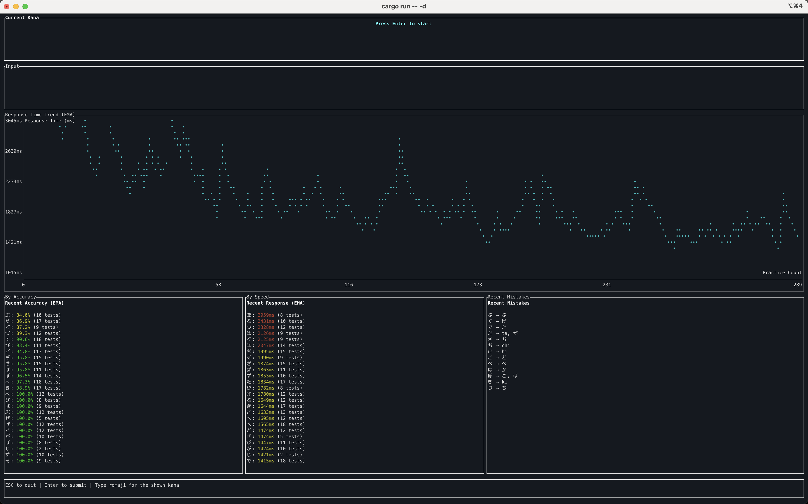
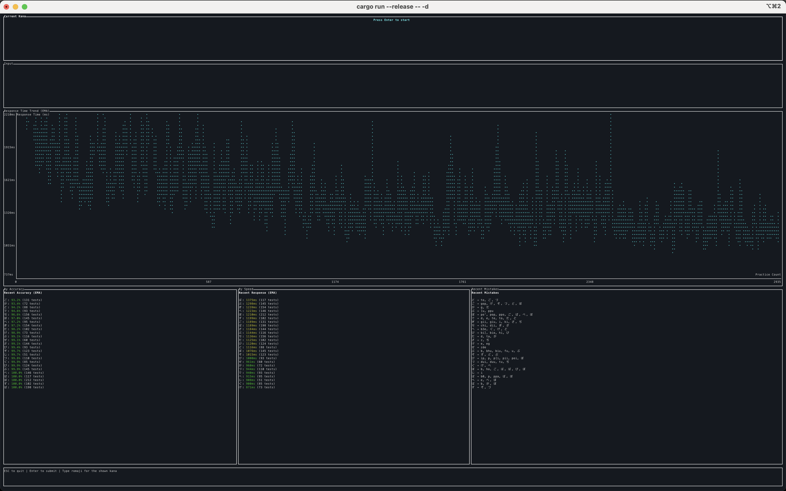

# Demo

The Main Kana practice is shown below:


## Args

```sh
cargo run -- <arg>
<arg>     --main, -m: practice Main Kana
          --daku, -d: practice Dakuten Kana
          --comb, -c: practice Combined Kana
          --all,  -a: practice All Kana
```

This is the demo for `--daku`:



## Reference Practice Count

After practicing for more than 2500 times, you should be able to type romaji continuously with an average of 1000-1200ms per character shown. This delay has taken into account the time needed for typing and mistakes.

See the records for practicing dekuten kana below:


